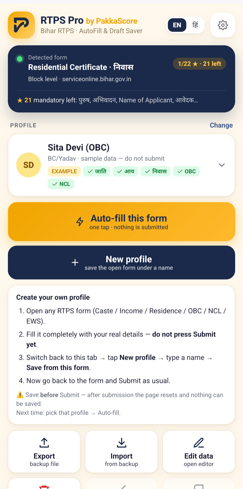
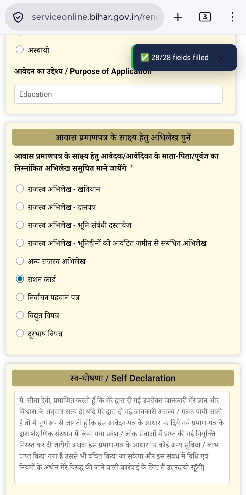
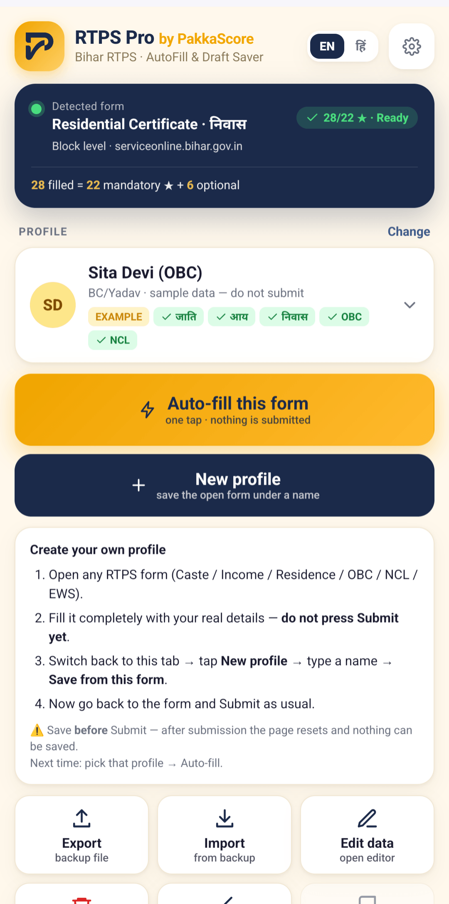

<h1 align="center">RTPS Pro by PakkaScore</h1>

<b>Bihar RTPS फ़ॉर्म एक बार सेव करें, अगली बार एक टैप में Auto‑fill करें।</b> 
Save a Bihar RTPS certificate form once — auto‑fill it next time in one tap.

---

## ⬇️ Download / डाउनलोड

| Browser | File | Install |
|---|---|---|
| **Firefox for Android** (recommended) · Firefox desktop | [`rtps-pro-firefox-signed.xpi`](../../releases/latest) | Tap the file → **Add**. Mozilla‑signed, no developer settings needed. |
| **Kiwi Browser** (Android) | [`rtps-pro.zip`](../../releases/latest) | `kiwi://extensions` → Developer mode ON → **+ (from .zip/.crx/.user.js)** → choose the zip |
| **Chrome / Edge / Brave** (desktop) | [`rtps-pro.zip`](../../releases/latest) | Unzip → `chrome://extensions` → Developer mode → **Load unpacked** → select folder |

📖 Guides in Hindi & English: **https://pakkascore.blogspot.com/search/label/RTPS%20Pro**

---

## क्या करता है / What it does

Bihar RTPS पोर्टल (`serviceonline.bihar.gov.in`) पर हर प्रमाण‑पत्र के लिए वही नाम, पिता का नाम, पता, जाति… बार‑बार टाइप करना पड़ता है। RTPS Pro उस फ़ॉर्म को एक **प्रोफ़ाइल** के रूप में सेव करता है और अगली बार एक टैप में भर देता है।

| फ़ॉर्म / Form | Service |
|---|---|
| जाति प्रमाण‑पत्र · Caste | अंचल स्तर |
| आय प्रमाण‑पत्र · Income | अंचल स्तर |
| निवास प्रमाण‑पत्र · Residence | अंचल स्तर |
| OBC‑NCL (भारत सरकार, Form‑VI) | अंचल स्तर |
| NCL (बिहार सरकार, Form‑IX) | अंचल स्तर |
| EWS प्रमाण‑पत्र | अंचल स्तर |

**Features**
- ⚡ One‑tap Auto‑fill incl. dependent dropdowns (State → District → Sub‑division → Block → Panchayat)
- 👥 Multiple profiles (family members / clients), search, duplicate, rename, edit any field
- ★ Live counter: *filled / mandatory* — green when every mandatory box is answered
- 💾 Draft auto‑save while typing; restore after session timeout / refresh
- ⬆️⬇️ Export / Import JSON backup (also imports the old "Bihar RTPS – Auto Save & Fill" backups)
- 🌐 UI in हिन्दी or English (one at a time), automatic dark mode
- 🔒 100 % on‑device: no server, no account, no analytics, no network requests

**Never does:** press Submit, upload photo, solve captcha, or bookmark deep links — you stay in control.

## 10‑second test

Two example profiles are bundled — **Sita Devi (OBC)** and **Rahul Sharma (EWS)** — with clearly fictitious data (Aadhaar `0000 1111 2222`, mobile `98765 43210`). Open any RTPS form → pick an example → **Auto‑fill**. *Never submit example data.*

## How to save your own profile

1. Open an RTPS form and fill it with real details.
2. **Before pressing Submit** → open RTPS Pro → **नई प्रोफ़ाइल / New profile** → name → **इस फ़ॉर्म से सेव करें / Save from this form**.
3. Submit as usual. Next time: open form → choose profile → Auto‑fill.

## Screenshots

| | | |
|---|---|---|
|  |  |  |

## Privacy

All profiles live in your browser's extension storage. The extension requests access only to `https://serviceonline.bihar.gov.in/*` and makes **no network requests** of its own. Full policy: see the *Help* tab inside the extension.

## Disclaimer

RTPS Pro is an independent, free helper tool by PakkaScore. It is **not** affiliated with the Government of Bihar or the RTPS / ServicePlus portal. You are responsible for the accuracy of anything you submit.

## Changelog

See [Releases](../../releases).

## License

MIT © PakkaScore
