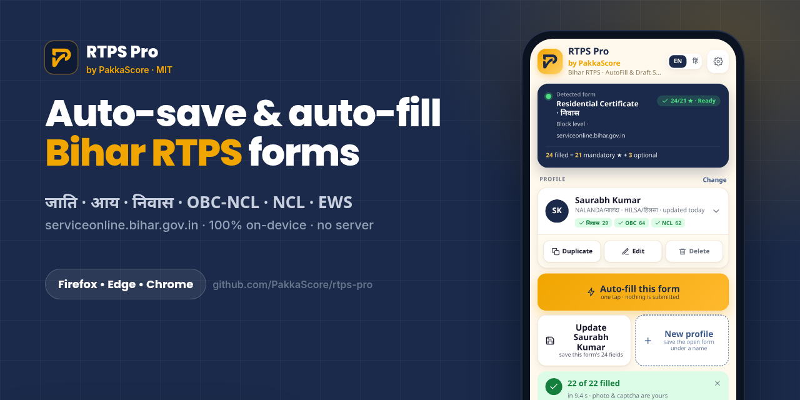

# RTPS Pro Extension

**RTPS Pro is a free, open-source browser extension for [serviceonline.bihar.gov.in](https://serviceonline.bihar.gov.in) that saves your Bihar RTPS form once and auto-fills it in one tap next time.**

Getting a caste, income or residence certificate in Bihar means filling the same form again and again — name, father's name, mother's name, address, caste, district, block, panchayat, police station. Need three certificates? Fill three times. Family of four? Twelve times. And if the portal session times out, you start over.

RTPS Pro eliminates this. Fill any supported form once, save it as a named profile, and auto-fill any future form in one tap — with cascading dropdowns (State → District → Sub-division → Block → Panchayat), live mandatory-field counter, draft recovery, and 100% on-device privacy. No account, no server, everything stays on your phone or computer.

Works with all six Block-level (RO) forms: **जाति (Caste) · आय (Income) · निवास (Residence) · OBC-NCL (Govt. of India, Form-VI) · NCL (Govt. of Bihar, Form-IX) · EWS**.

## Browser support — Firefox • Edge • Chrome

| Browser | Platform | Install | Auto-update |
|---|---|---|---|
| **🦊 Firefox** ⭐ Recommended | Android + Windows / macOS / Linux | [**Add to Firefox**](https://addons.mozilla.org/firefox/addon/rtps-pro/) | ✅ |
| **🌊 Edge** | Android + Windows / macOS | [**Get from Edge Add-ons**](https://microsoftedge.microsoft.com/addons/detail/gdicmdfikcnmgajipklnfmkjfcdmlbki) | ✅ |
| **🌐 Chrome** | Desktop only | [`rtps-pro.zip`](https://github.com/PakkaScore/rtps-pro/releases/latest/download/rtps-pro.zip) → `chrome://extensions` → Developer mode → **Load unpacked** | manual (load the new zip) |

**Why Firefox?** Desktop Chrome/Edge sometimes show *"Your connection is not private"* on serviceonline.bihar.gov.in; Firefox opens it fine, and the portal's own compatible-browsers note recommends Firefox. On Android, Firefox and Edge are the two browsers that officially support extensions.

Other Android browsers (Quetta / Kiwi) — from the zip

[Quetta](https://play.google.com/store/apps/details?id=net.quetta.browser) (Play Store) or [Kiwi](https://github.com/kiwibrowser/src.next/releases/tag/14310011181) (GitHub, discontinued but working): download `rtps-pro.zip` → menu → **Extensions** → **Developer mode** → **+ (from .zip/.crx/.user.js)** → choose the zip. No auto-update — re-add the new zip (profiles are kept). For official support use Firefox or Edge.

## Use

1. Open any RTPS form on `serviceonline.bihar.gov.in` (Apply Online → RTPS Services → General Administration → Caste / Income / Residence / OBC-NCL / EWS → Block level) and fill it.
2. **Before Submit** → open RTPS Pro → **New profile** → name → **Save from this form** → then Submit normally.
3. Next time: open the form → pick the profile → **Auto-fill**. Only photo & captcha remain.

Two clearly fictitious example profiles are bundled — **Sita Devi (OBC)** and **Rahul Sharma (EWS)**, Aadhaar `0000 1111 2222`, mobile `98765 43210` — so you can try Auto-fill before saving anything. Never submit them.

## Features

- **One-tap Auto-fill** — 20–30 boxes in a few seconds, including the dependent dropdown chain (State → District → Sub-division → Block → Panchayat, Caste → Sub-caste), waited for via `MutationObserver`, not fixed sleeps
- **Multiple profiles** — family members / customers, searchable; **Duplicate · Edit · Delete** right on the profile card; per-form badges (`निवास 22 · OBC 50`). Duplicate copies any profile including examples, with suggestions like "Sita Devi (Hilsa)" / "Sita Devi 2"
- **Per-form storage** — income, declarations and other form-specific boxes are kept per form; basic details are shared, so one saved form fills the basics of every other form
- **Mandatory-field counter** — `24 filled • 21 required • 3 optional`, with the missing required boxes listed (never a percentage)
- **Unique names + identity guard** — duplicate profile names are blocked with suggestions; before *Update* the page is compared with the selected profile and a mismatch asks "Different person?" (override needs a second tap)
- **Draft recovery** — auto-saves while typing; restore after refresh / session timeout (7-day expiry)
- **Session-timeout helper** (3.9.6) — clear message + *Open RTPS Home* on the portal's "SESSION TIMED OUT" page
- **Backup** — Export / Import JSON (one profile or all) + gentle backup reminder. Bottom grid: 4 larger tiles — Export, Import, Clear form, Restore examples
- **Never touches** photo, captcha, OTP or Submit — you review and submit yourself
- **हिन्दी / English** UI (default Hindi), automatic dark mode, mobile-first layout
- **Shortcuts** — `Alt+Shift+F` fill, `Alt+Shift+S` save, right-click menu (desktop)

## Privacy

100 % on-device. Profiles, drafts and settings live in `chrome.storage.local` only. No server, no account, no analytics, no remote code, no network requests of its own. Permissions: `storage`, `activeTab`, `scripting`, `contextMenus`, `tabs`; host access limited to `https://serviceonline.bihar.gov.in/*`. Uninstalling removes all data.

## What's new in 3.9.6

- **Now on Edge Add-ons** — official install & auto-update on Edge for Android and desktop
- Profile card actions: **Duplicate · Edit · Delete** directly under the selected profile (Duplicate = copy with same address for another family member)
- **Session-timeout** message with *Open RTPS Home*; drafts still restored afterwards
- Popup simplified (form chips removed), smaller build, faster fill, several small fixes
- Backup and rating reminders are rarer and have *Later* / *Never ask*

Earlier: 3.9.5 unique names, identity guard, form badges · 3.9.4 stable release · see [Releases](https://github.com/PakkaScore/rtps-pro/releases).

## Help & support

- Guides (Hindi & English): https://pakkascore.blogspot.com/search/label/RTPS%20Pro
- Download page: https://pakkascore.blogspot.com/2026/09/rtps-pro-download.html

New fields added by the RTPS portal are picked up automatically on the next Save — no update needed.

MIT License · © 2026 PakkaScore

> **✅ Always FREE.** RTPS Pro never asks for money — not on WhatsApp, not anywhere. The genuine extension exists only on Firefox Add-ons (by PakkaScore), Edge Add-ons and this repository. Anyone demanding payment under this name is a fake copy — please report it on the store.

**Disclaimer:** RTPS Pro is an independent tool by PakkaScore. It is not affiliated with, endorsed by, or connected to the Government of Bihar, NIC, or the RTPS / ServicePlus portal. Always review the form before submitting.
